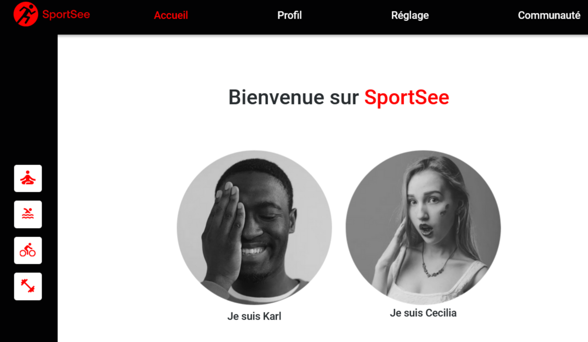

# Dashboard SportSee

   
   
   
   

 

## Prerequis
### Install NodeJS :
### Install yarn via npm with command :
  - npm install --global yarn 

## Install and Execute this project

### Clone this repository :
- git clone https://github.com/DylanJana/Developpez_un_tableau_de_bord_analytics_avec_react

### Go to the backend 
- use command : cd backend
### Install dependencies and run backend
- use command : 
  - yarn install
  - yarn dev

### Go to the frontend
- use : cd frontend
### Install dependencies and run frontend
- use command : 
  - npm install
  - npm start

## Navigate to Sportsee App : http://localhost:3001/
- on Home Page, choice your user
- You have access to differents graph of your user 

## Using Api data or Data mock :
- Go to apiRequest.js
- Line 21, switch value of variable : usingApi of false at true

 
